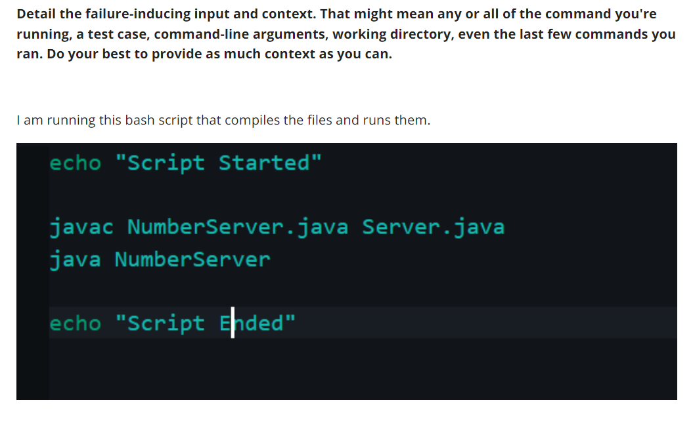
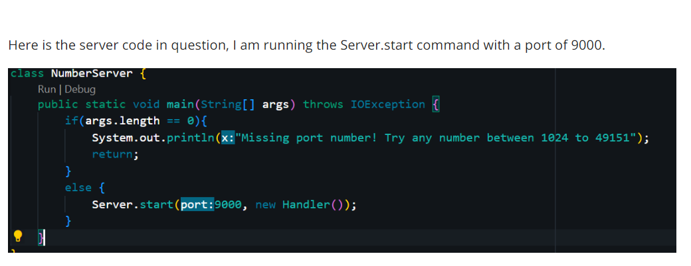
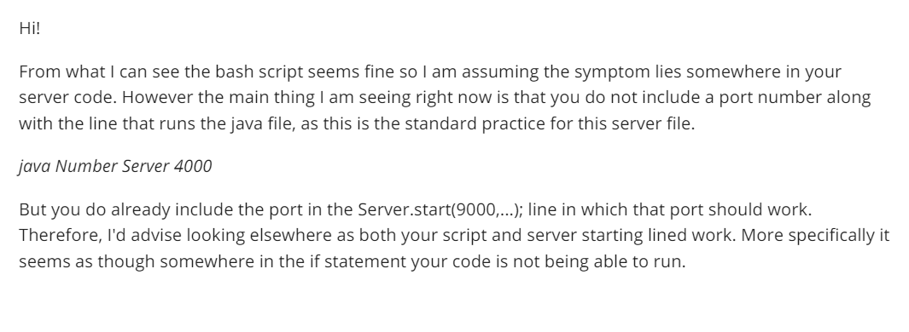
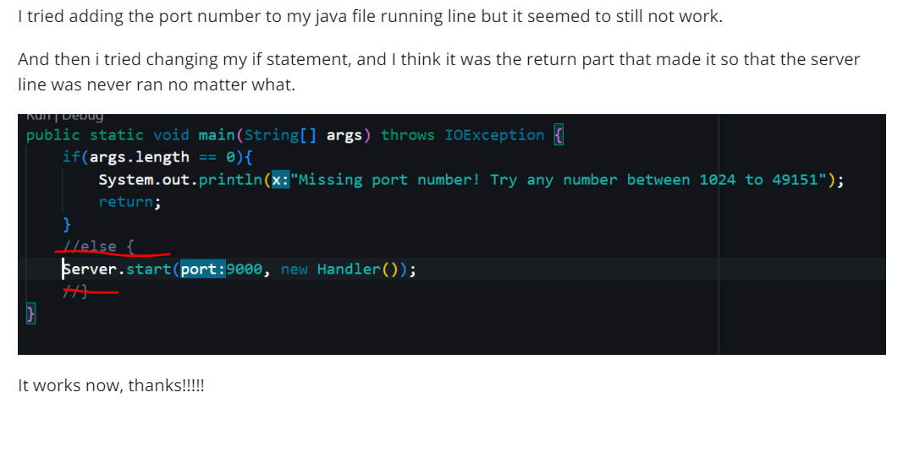
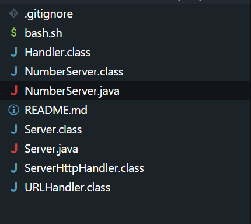

# Lab Report 5

### Original Student Post

### TA Response

### Student Response

### Additional Info

``import java.io.IOException;
import java.net.URI;

class Handler implements URLHandler {
    // The one bit of state on the server: a number that will be manipulated by
    // various requests.
    int num = 0;

    public String handleRequest(URI url) {
        if (url.getPath().equals("/")) {
            return String.format("Number: %d", num);
        } else if (url.getPath().equals("/increment")) {
            num += 1;
            return String.format("Number incremented!");
        } else {
            System.out.println("Path: " + url.getPath());
            if (url.getPath().contains("/add")) {
                String[] parameters = url.getQuery().split("=");
                if (parameters[0].equals("count")) {
                    num += Integer.parseInt(parameters[1]);
                    return String.format("Kiichi's Number Increased by %s! It's now %d", parameters[1], num);
                }
            }
            return "404 Not Found!";
        }
    }
}

class NumberServer {
    public static void main(String[] args) throws IOException {
        if(args.length == 0){
            System.out.println("Missing port number! Try any number between 1024 to 49151");
            return;
        }
        else {
            Server.start(9000, new Handler());
        }
    }
}

``

To edit, simply take the Server.start line out of the else statement.
Bash script was unchanged and is included in the student post.
